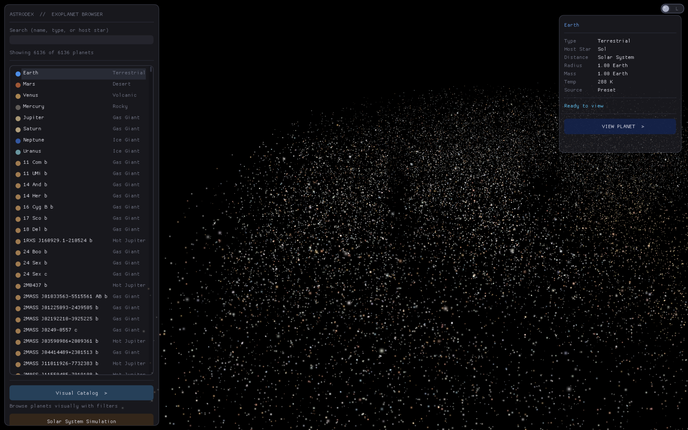

# Pony Stark — Exoplanet Renderer

Real-time procedural exoplanet renderer. Pulls data from NASA, sends it to Gemini, and renders every confirmed exoplanet as a unique 3D world using raymarching shaders -- all inside a Pepper's Ghost holographic display.

## What It Does

1. **Fetches real exoplanet data** from three sources: NASA Exoplanet Archive (TAP API), ExoMAST, and Exoplanet.eu
2. **Fills in the gaps with AI** -- most planets have incomplete data (only ~70 of 5,800+ have detected atmospheres). Gemini `gemini-3-flash-preview` infers atmosphere composition, surface properties, and rendering parameters using astrophysical models and molecular absorption physics
3. **Renders procedural planets** in real-time using GLSL fragment shaders with raymarching. No textures -- every planet is generated purely from math
4. **Galaxy view** shows the actual sky positions of all discovered exoplanets. Click any dot to zoom in and see what that world might look like
5. **Pepper's Ghost quad-view** renders from four camera angles simultaneously for holographic projection
6. **Gesture control** via UDP input from the iPhone HoloGesture app (fist, pinch, swipe, open palm)

## Tech Stack

- **Language**: C++23
- **Graphics**: OpenGL 4.1 (macOS compatible), GLFW, GLAD
- **Shaders**: Custom GLSL raymarching (planet surface, atmosphere, clouds, rings, terrain, starfield, galaxy)
- **UI**: Dear ImGui (docking branch) + ImPlot for data visualization
- **AI**: Google Gemini (`gemini-3-flash-preview`), AWS Bedrock (Claude), Groq (Kimi K2), chatjimmy.ai (Qwen/Llama)
- **Physics**: N-body orbital simulation with octree acceleration (Barnes-Hut)
- **Data**: NASA TAP, ExoMAST, Exoplanet.eu REST APIs via libcurl
- **Math**: GLM
- **Logging**: spdlog
- **JSON**: nlohmann/json
- **Build**: CMake 3.25+, FetchContent for all dependencies

## Build

```bash
mkdir build && cd build
cmake .. -DCMAKE_BUILD_TYPE=Release
make -j$(nproc)
./astrosplat
```

### Requirements

- C++23 compiler (Clang 16+ / GCC 13+)
- OpenGL 4.1+ capable GPU
- libcurl (system package)
- CMake 3.25+

All other dependencies (GLFW, GLM, spdlog, ImGui, ImPlot, GLAD, nlohmann/json) are fetched automatically via CMake FetchContent.

### Optional Environment Variables

```bash
export GEMINI_API_KEY="..."           # Google Gemini (preferred for hackathon)
export AWS_ACCESS_KEY_ID="..."        # AWS Bedrock (Claude)
export AWS_SECRET_ACCESS_KEY="..."
export GROQ_API_KEY="..."             # Groq (Kimi K2)
```

At least one AI backend is needed for planet generation from exoplanet data. Without any key, the app still works with manual parameter tweaking and preset planets.

## Executables

| Binary | Description |
|--------|-------------|
| `astrosplat` | Main app -- galaxy view, planet detail, solar system sim, quad-view hologram |
| `starexplorer` | Standalone 3D star field navigator using real Gaia DR3 data |
| `star_lod_builder` | Offline tool to preprocess star catalogs into multi-LOD binary format |

## Architecture

```
src/
  core/           Window, Application, Logger
  render/         Renderer, Camera, ShaderProgram, SphereRenderer, OrbitRenderer, RingRenderer
  ui/             UIManager, GalaxyView, DataVisualization (ImGui/ImPlot)
  ai/             InferenceEngine, GeminiClient, BedrockClient, GroqClient, JimmyClient, PromptTemplates
  data/           ExoplanetData, NasaApiClient, ExoMastClient, ExoplanetEuClient, ExoplanetDataAggregator
  physics/        CelestialBody, PhysicsWorld, Integrator, Octree (Barnes-Hut N-body)
  simulation/     Simulation (solar system presets)
  config/         SystemConfig, PresetManager (JSON planet presets)
  input/          GestureInput (UDP receiver for iPhone gestures)
  explorer/       StarRenderer, StarData, StarLOD, FreeFlyCamera, StarExplorerApp
  intro/          IntroAnimation
shaders/          GLSL vertex/fragment/tessellation shaders
configs/          Solar system JSON preset
scripts/          Python tools for star catalog processing
```

## AI Planet Generation

When you search for an exoplanet (e.g., "TRAPPIST-1 e"), astrodex:

1. Queries NASA TAP + ExoMAST + Exoplanet.eu for all known data
2. Classifies the planet type from density, mass, and radius
3. Sends the data to Gemini with a detailed prompt including molecular absorption tables, stellar type color corrections, and reference planet examples
4. Gemini returns a complete `PlanetParams` JSON with 60+ rendering parameters
5. The shader renders the planet in real-time with the generated parameters

The prompt system encodes real astrophysics: molecular absorption bands determine atmosphere color (CH4 absorbs red, making Uranus blue; Na/K absorb yellow, making hot Jupiters orange), stellar type shifts all colors (red dwarf planets get orange atmospheres, not blue), and temperature determines surface regime (lava vs. ocean vs. ice).

## Controls

| Input | Action |
|-------|--------|
| Mouse drag | Orbit camera |
| Scroll | Zoom |
| Click planet (galaxy view) | Load planet detail |
| `H` | Toggle quad-view (Pepper's Ghost mode) |
| `G` | Toggle gesture input HUD |
| `?` | Help overlay |
| Fist gesture | Confirm / action |
| Open palm gesture | Zoom (Z movement) |
| Swipe gesture | Rotate view |

## Screenshots




