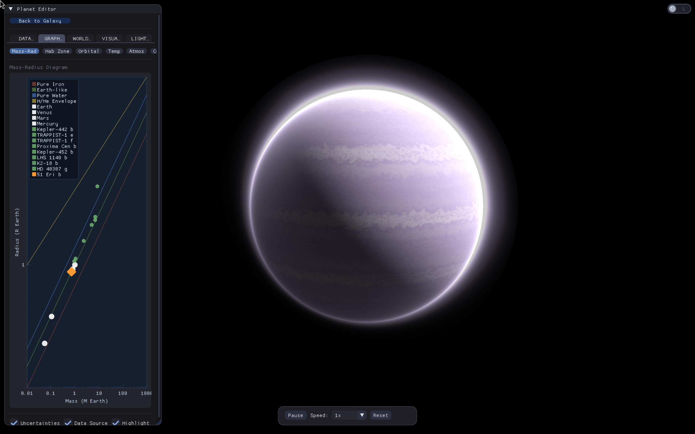
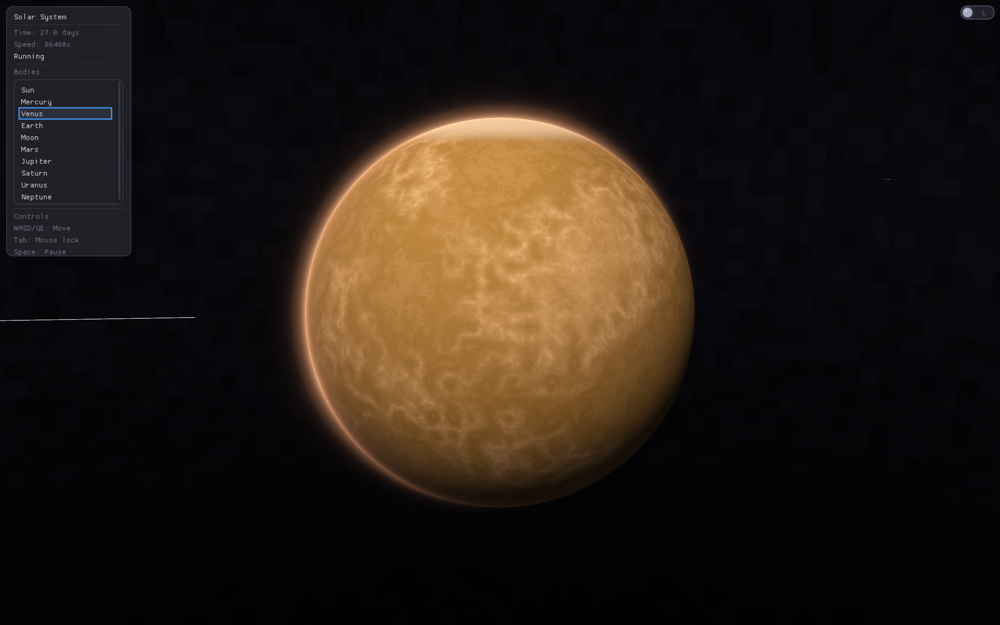

# astrodex

visualize every exoplanet ever discovered. yeah all 5000+ of them.

## the problem

nasa has cataloged thousands of exoplanets but theres no way to actually visualize them. scientists and educators are stuck with spreadsheets and tables. the public has no intuitive way to explore these discoveries. astronomical data exists in isolation from human understanding.

we bridge that gap.

## what it does

pulls real data from nasa exoplanet archive, exoplanet.eu, and exomast. throws it at an ai and cust omBERT model to predict atmospheric composition and fill in the gaps. renders procedural planets in real time using raymarching shaders. galaxy view showing actual positions of discovered exoplanets. click any dot, zoom in, see what that world might actually look like.

basically we turned a database into a universe you can explore.

## the stack

c++20, opengl 4.5, glfw, imgui, nasa tap api, exoplanet.eu, exomast, groq kimi k2, aws bedrock, custom raymarching planet renderer, physics sim for orbital mechanics

## quick start

```
mkdir build && cd build
cmake .. -DCMAKE_BUILD_TYPE=Release
make -j$(nproc)
./astrosplat
```

needs opengl 4.5+, curl, glfw3, glm

optional set GROQ_API_KEY or AWS_ACCESS_KEY_ID/AWS_SECRET_ACCESS_KEY for ai features

## screenshots






## features

real science with actual orbital periods, temperatures, star types, atmospheric detections

ai data-fill prediction for when jwst hasnt looked at a planet yet

procedural everything with no textures, pure math, each planet rendered from orbital params hence lossless rendering + infinite scaling

galaxy scale view showing where these worlds actually are relative to earth

built for aiengine hackathon 2026
